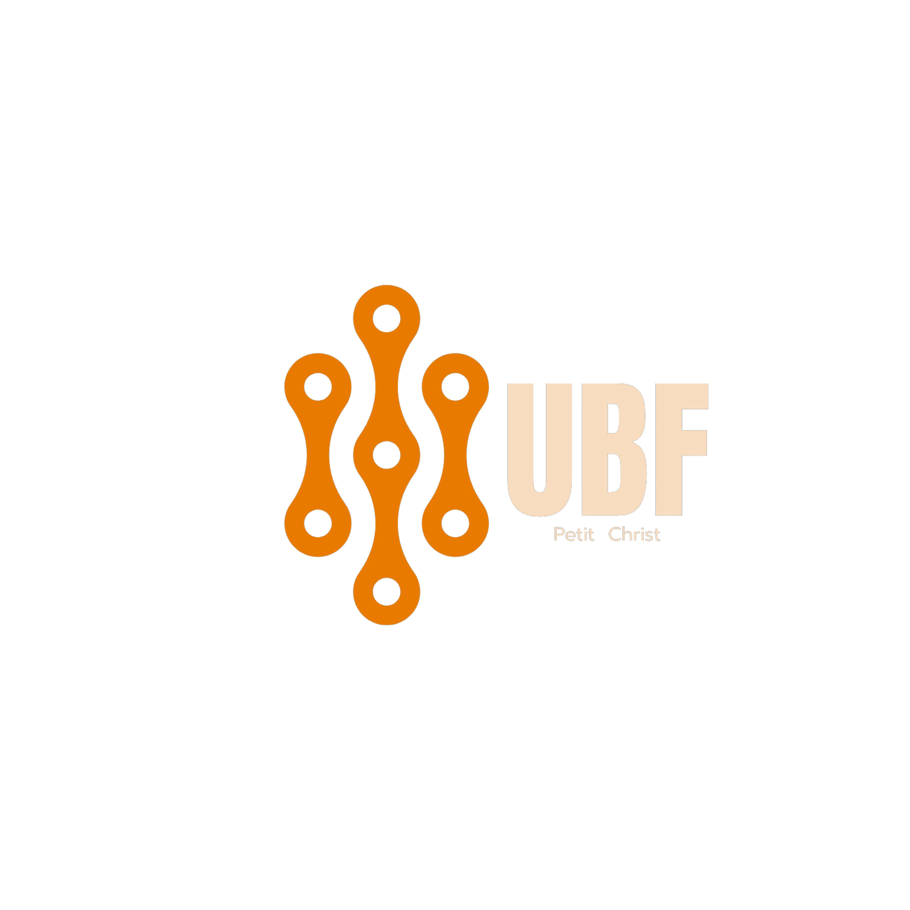

<div align="center">



# UBFdesign

**Mon portfolio · My portfolio** — Graphic Design · UI · Frontend

[](LICENSE)
[](https://react.dev/)
[](https://vitejs.dev/)
[](https://sass-lang.com/)
[](https://ubf-design.vercel.app)

🇫🇷 **Français** · [🇬🇧 English](#-english)

</div>

---

## 🇫🇷 À propos

Vitrine web de **Béni Uwayo** (`ubf-hunter`) — designer et développeur frontend.
Le site rassemble une sélection de projets *graphic design*, *UI design* et *frontend*.

🌐 **En ligne : [ubf-design.vercel.app](https://ubf-design.vercel.app)**

## ✨ Contenu

- 🎨 **Featured Work** — sélection de mockups et de projets d'interface
- 🧩 **Composants réutilisables** — `Library`, `Workart`, `Button` (React + SCSS)
- 🖼️ **Assets propres** — logos, textures, mockups livrés dans `public/`
- 📱 **Responsive** — pensée d'abord pour la lecture desktop, adaptée mobile

## 🛠️ Stack technique

| Outil | Rôle |
|---|---|
| **React 19** | Composants d'interface |
| **Vite 6** | Bundler et dev server |
| **SCSS (Sass)** | Styles modulaires, variables, mixins |
| **ESLint** | Qualité du code |
| **Vercel** | Hébergement statique |

## 🚀 Lancer en local

```bash
git clone https://github.com/ubf-hunter/UBFdesign.git
cd UBFdesign
npm install
npm run dev            # http://localhost:5173
```

Autres commandes :

```bash
npm run build          # bundle de production dans dist/
npm run preview        # sert le bundle de production en local
npm run lint           # lint ESLint
```

## 🗂️ Structure

```
UBFdesign/
├── public/                 # logos, mockups, textures
├── src/
│   ├── components/         # Library, Workart, Button
│   ├── styles/             # feuilles SCSS globales
│   ├── App.jsx             # entrée applicative
│   └── main.jsx            # bootstrap React
├── index.html              # racine HTML Vite
├── vite.config.js          # configuration Vite
└── eslint.config.js        # configuration ESLint (flat config)
```

## 📬 Retours et contribution

Ce dépôt est un portfolio personnel. Les **retours, signalements de bugs** ou **suggestions d'améliorations UI/UX** sont les bienvenus :

- 🐛 [Ouvrir une issue](../../issues)
- 🤝 Le processus complet est décrit dans [CONTRIBUTING.md](CONTRIBUTING.md)

Pour toute demande de collaboration, contactez [@ubf-hunter](https://github.com/ubf-hunter).

## 📄 Licence

Code sous licence **MIT** — voir [LICENSE](LICENSE).

> ⚠️ La licence MIT couvre le **code** du site. Les **visuels du portfolio** (mockups, logos de projets clients, photographies) restent la propriété de leurs auteurs respectifs et **ne sont pas** réutilisables sous MIT sans accord explicite.

---

## 🇬🇧 English

### About

Web showcase for **Béni Uwayo** (`ubf-hunter`) — designer and frontend developer.
The site gathers a curated selection of *graphic design*, *UI design* and *frontend* projects.

🌐 **Live: [ubf-design.vercel.app](https://ubf-design.vercel.app)**

### Content

- 🎨 **Featured Work** — mockups and interface projects
- 🧩 **Reusable components** — `Library`, `Workart`, `Button` (React + SCSS)
- 🖼️ **Clean assets** — logos, textures, mockups shipped under `public/`
- 📱 **Responsive** — designed for desktop reading first, adapted for mobile

### Tech stack

| Tool | Role |
|---|---|
| **React 19** | UI components |
| **Vite 6** | Bundler and dev server |
| **SCSS (Sass)** | Modular styles, variables, mixins |
| **ESLint** | Code quality |
| **Vercel** | Static hosting |

### Run locally

```bash
git clone https://github.com/ubf-hunter/UBFdesign.git
cd UBFdesign
npm install
npm run dev            # http://localhost:5173
```

Other commands:

```bash
npm run build          # production bundle in dist/
npm run preview        # serve the production bundle locally
npm run lint           # ESLint check
```

### Feedback and contribution

This repository is a personal portfolio. **Feedback, bug reports** or **UI/UX suggestions** are welcome:

- 🐛 [Open an issue](../../issues)
- 🤝 The full process is described in [CONTRIBUTING.md](CONTRIBUTING.md)

For collaboration requests, reach out to [@ubf-hunter](https://github.com/ubf-hunter).

### License

Code under the **MIT License** — see [LICENSE](LICENSE).

> ⚠️ The MIT license covers the site's **code**. **Portfolio visuals** (mockups, client project logos, photographs) remain the property of their respective authors and are **not** reusable under MIT without explicit agreement.

---

<div align="center">

Made by **Béni Uwayo** · [@ubf-hunter](https://github.com/ubf-hunter)

</div>
